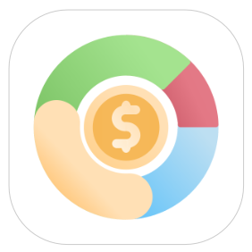

TLDR; [Cashew](https://github.com/jameskokoska/Cashew) is your one stop personal finance app with expense tracking, budgeting, net worth calculation and so much more. It's code has been open sourced, the project is actively in development, the interface and animations are blissful, works locally with optional sync to your own cloud. Import, export and no limit on the history!

### Finances? Tracking? BORING!

> “What is not defined cannot be measured. What is not measured, cannot be improved. What is not improved, is always degraded”. - William Thomson Kelvin

I've lost count of the number of times that I thought to myself along the lines of:

- "My bank account is empty and it has only been a week since salary has been credited?"
- "What is this ₹ 1467.97 that has been debited from my account?"
- "How much am I spending on my training YoY?"
- "Did I pay Mohit ₹2050 that I borrowed that one time?"
- "How much did my impulsive solo trip to Badami cost?"

It is boring to talk about money vaguely and a futile exercise to do so without any system or process to manage it. Overspending, redundancies, oversight, anxiety are all the result of poor money decisions and can harm both your financial and mental well being. Recurring payments have a special spot in this fiasco as they are fixed expenses if not accounted for before you spend money, can throw your whole month off track.

### But isn't this already tracked in multiple places?

Yes, unless you are paying by cash, all of this is being tracked I would say pretty well. UPI has made all our lives easier by making spending money a breeze. Credit cards with no cost EMI's, tap to pay, NFC payments, BNPL's etc, every app is another record of payments even down to the time the payment was made. True.

All this data is readily available, by readily available, I mean I have to take a weekend or two to consolidate the data, export it to a file, import it to my software of choice, clean up the data _(this sure is fun)_, sift through each line item and categorize spends and chuck the rest to "Unknown Spends" and hope to reach some semblance of a conclusion on how to plan my finances next month. And if the stars align visualize it so that I have something to show for my hours of work.

### Should I be counting pennies from tomorrow?

Not necessarily. All you need is to label each expense as you make it and categorize it logically so that it makes sense to look at the data after the fact. You need to track your income, budget savings, calculate head wise expenses, and plan for any future spends. Easy.

### Ok Joe, But why Cashew?

To put it simply, Cashew offers a great deal of features for not all that complexity. Having tried multiple apps, paid ones, free ones, self hosted ones and more, Cashew is the one app I consistently come back to. 

Here are all the reasons I personally use Cashew:

1. **It is open source and completely free to use** : There is a *"paywall"* that asks you to pay, and indeed you should if you can afford to in order to support the developer. But you can unlock it for free by staying on the page for 20ish seconds.

2. **UI/UX** : This has to be the best application I have used by far. It is miles ahead of any other application in terms of the beauty of the UI. Truly is a work of art. The animations, the common sense gestures, the flowy charts. If nothing, you gotta try out the app just for this.

3. **Robust Features** : Every inch of the app is thoughtfully made and just makes sense once you get the hang of it. The implementation is such that you cant mess it up. I mean sure you can, but nothing you can't fix.

4. **Local first** : The app does not need an internet connection or even an account for that matter. It works on .sqlite files that are stored locally. If you need the sync features, you can connect it to your own Google account and your Google Drive so it works on multiple devices.

5. **Great team** : As it goes without saying the developer is super nice and responsive via emails. Raise a PR and contribute to the app if you find something to iron out. 

6. **Customizability** : Endlessly customizable from the layout to the colors, to the views. Make it exactly like you want it. This also goes with your budgeting, spending, recurring payments etc, it is all flexible all modifiable.

### Conclusion

Overall I can't stop praising how good of an app this is. Try it for yourself. I have been using it consistently for 3 months and it has made my spending more mindful and the data more insightful. Let me know if you liked it, cheers!
