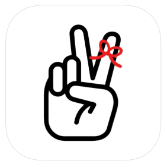

TLDR; [Twos](https://www.TwosApp.com?code=joel) _(active referral link)_ is the best cross platform, completely free, feature rich note taking/PKM app with a responsive dev team that I am using for my own note taking needs for the last 2 years. Will it suit yours? I guess by the end of this post you will find out.

### Why do you need another note taking app?

> The best place to write things down.

This is what Twos is based on. Let's face it we all have come across a situation where we wanted to write something down, or take a note only to never find it again. Another can of worms is **_HOW_** we "_write_" things down. For me it could look like:

- Sending myself a text message
- Writing it on a piece of paper or my palm
- Using one of many note taking apps that I have on my device
- The worst offender of all - NVM I'll remember it (which of course I do not)

Then there are a lot of other problems that arise from making this mistake of grabbing the closest object as your solution for taking notes. You miss out on easy editing, historical notes, tracking, searching, sharing, reusing, scheduling and so on.

Going from any of these to physical notebooks like Field Notes or to applications might solve many of the problems at least partially. Your calendar might be on Google/Apple, reminders on another, to do lists on something else, notes and text summaries on another and so on. Although the original problem has been solved somehow, **_not_** having it all in one place eventually will cause more problems than you originally began with.

Missed reminders, untracked tasks, locked out insights from notes, duplicate calendar entries and the list is again endless. The solution is to bring all the redundant workflows into one streamlined one.

### Ok Joe, not great but not terrible. But why Twos?

I hear you, you might already be on the default note taking app on your device and it might perfectly suit your needs.

> [!IMPORTANT]
> The best app for you, is the one that you actually use!

Personally, having used almost all the major note taking and PKM apps in the market for the last few years I have settled down with Twos and Obsidian (_more on that later_).

Here are all the reasons I personally use Twos:

1. **It is completely free to use** : Yes! Although you can choose to support the developers via in-app purchases, and there is a coin system that gamifies the experience, the app itself is 100% free.
2. **Truly cross platform** : Great support across devices, OS's and browsers.
3. **Shockingly intuitive** : If you have used any PKMs at all, translating the knowledge to Twos will be a breeze with several quality of life addons. And if not, there is a really cool walkthrough demo with the beginner in mind. Either way your'e golden!
4. **Calendar and Integrations** : Connect your calendar, email, SMS, WhatsApp; all the essentials and sync it both ways!
5. **Privacy/No Ads** : Having no incentive to sell data to 3rd Parties for ads, encrypting the data both at rest and transit is good enough when compared to other apps out there. Also if you're storing passwords in plain text, you have much larger problems at hand.
6. **Bells and Whistles** : The app is loaded with features lists, sub lists, templates, Twos World, usable reminders, graph view, collaboration features with new ones being added frequently, it also has AI integrations which is usable with out leaving the app. Honestly I think there are more features in there that I probably haven't used in the last 2 years.
7. **Long term vision** : Although there is a running joke about being acquired by Google, they plan to keep the service alive forever, bold claims. At the very least they have kept the users in mind, as they have the option to leave nominees for their Twos profile. Talk about EoL support. 🫡
8. **Passionate Dev Team** : [Parker](https://www.parkerklein.com/) and [Joe](https://www.twosapp.com/@Joe) are an amazing duo. Having talked to them, followed their content for years now I can say there are are not a lot of creators/founders who are like them, in a good way of course. Very responsive to feedback and issues.

### Conclusion

I am not trying to convince you to switch to use Twos, but to point out why I chose it for myself. Should you choose to switch to it. Let me know if you have any questions and do check out [Twos](https://www.TwosApp.com?code=joel) _(active referral link)_ while you're at it, cheers!

[Twos YouTube](https://www.youtube.com/@TwosApp)
