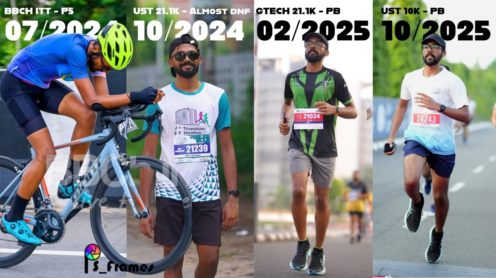
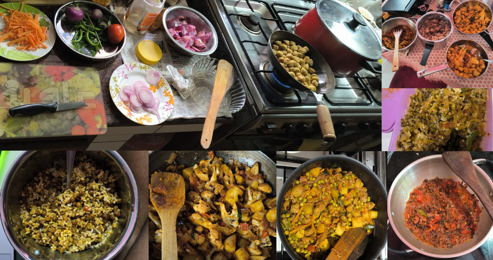
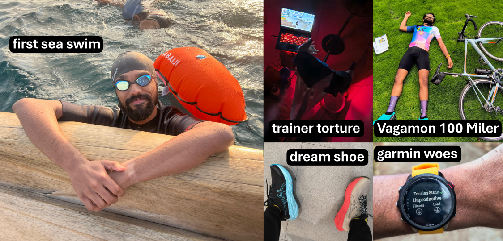

 




Find the hardest thing you enjoy doing.



As a 28 YO adult onset triathlete who is probably below average in all three sports, I still enjoy the process of becoming a lifelong athlete.



  <!--  -->


<!--  -->



### Triathlon? What is that?

It is an event with 3 disciplines; swimming biking and running. For the ones who are a bit more curious read more [here](https://triworldhub.com/types-of-triathlons/). Basically you start out swimming, then you get on the bike and finally finish the event with a run. The distances, environments cut off times etc. change based on the event but essentially this is what a triathlon is.

### Cool. But why triathlons?

This question is I get asked on a regular basis. So it all began when my dad bought a bicycle for me to commute to the bus stop during my college days. One thing led to another and now I am neck deep in the sport. It is also a running joke about how the 90's kids are either married or doing triathlons.

I usually answer that it is a hobby, I like being active, it is good for health etc. All shallow answers. But for the ones who really pick my brain. I reply
> Why not triathlons?

Hear me out. If you are reading this, and are blessed with a healthy body, an hour everyday and autonomy over your choices, why wouldn't you try to maximize your abilities? Your daily run will only ever be a dream to someone who is bed ridden. Your excuse that the pool water is cold, will be a wish for someone without access to one. That flat tyre on your bike? Guess what, someone somewhere will be looking at a picture of a bike wanting to just see it in real life.

You have a moral obligation to stay healthy; to look after yourself and in turn the world around you.

Here are my assortment of reasons:

* You will only get older, weaker, stiffer, \<insert your excuse here\>, as you age so make the most of it.
* Meet incredible coaches and athletes and learn from them.
* Keeping the body and mind active is essential.
* Having a structure to your life will not hurt.
* You will have to unlearn and relearn everything.
* Saying that you are a triathlete sounds cool.
* You pick up life lessons that can only be gained through testing your limits.
* Eating clean will be the norm.
* No space for bad habits like drinking, smoking etc.
* You will have more things to talk about to people about than movies, weather, gossips etc.
* You will appreciate the value of time. 
* Cooking meals from scratch is imperative and it is not rocket science.
* Building grit and mental toughness.

The list goes on and on. 

### So it is sunshine and rainbows?

Far from it. For all the benefits of trying to be an athlete, it comes with it's share of pickles.

* Waking up early for workouts.
* Fitting in training with your full time job.
* Planning meals in advance and sticking to it.
* Spending a lot of money on coaching, training gear, supplements, travel, event registrations, and more.
* Constant self doubt and comparison with athletes better than you.
* Facing my fear of water and swimming in the sea.
* Performance anxiety, DNF's, sickness, injuries, it is all part of the package.

### Why is it still so important to you?

Like everything else in life, it was an experiment on myself, a rumble strip to keep me centred. Although I would not have had any podium finishes (yet), accolades or even anything remotely out of the ordinary, I can carry all my learnings, apply it to other areas in my life and be a life long athlete.

The biggest takeaways I've had are:
1. Health takes #1 priority. Rather than saying you would die for your family, say I'll live healthily for them.
2. Discipline is the highest form of self-love.
3. It is "You" today versus "You" yesterday, always. 
4. Setbacks are the fuel to future successes.
5. You miss 100% of the shots you don't take.
6. Oh yes and cigarettes and alcohol are not cool, contrary to what you might have been conditioned to believe. Stay away from it.

Don't be scared of challenges, be scared of the person you'll become trying to avoid them.

### Okay it is not for everyone.

It probably isn't for everyone. It is an open challenge for anyone who is up for it. It is an ambitious goal, but if you really think about it, you are letting your body to do the things that it was designed to do. 

I am a better person because of it. I understand that it takes a lot of courage, humility and discipline to get anything worthwhile. It helps me to appreciate the sport and the passionate people who take the mantle forward.

### Closing thoughts?

As an aspiring triathlete, even though I'm not really good at it, for the last few years I've been training for the sport. It is probably the hardest thing I've done in my life. 

All said, it has undoubtedly been an invaluable learning experience through and through. It anchored me to a healthy lifestyle, to meet a lot of wonderful humans, experience first hand the need for discipline, working through failure, learning about biology, physiology, psychology and so much more. 

Would you want to try it? Let me know! I will be happy to welcome you to the club.

[LinkedIn Post](https://www.linkedin.com/feed/update/urn:li:activity:7385189003798638592/)