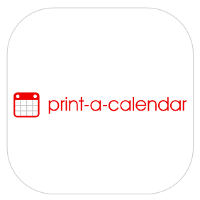

TLDR; [print-a-calendar](https://print-a-calendar.com/) is exactly what the name suggests. Prints a damn calendar. Genius!

### More calendars?

The answer is yes. On your phone, laptop, desktop, hell even mirrors roll out with clocks and calendars these days. It doesn't seem having these many around us is helping us any more than not having them.

Also a tool is only as useful as how you use it. Similarly a calendar is probably the most underrated, OG time management tool of all time.

> Having one printed out on your desk, where you strike out wasted days one by one and looking at the days left in the year; wait what? It is Q2 already!?

You get the idea, there is something tangible (pun intended), measurable, about a physical version of the calendar.

### Can't we just create one on Excel or something?

As with every other problem in life, maybe running towards Excel is not really required when you have a neat and free solution like print-a-calendar. It is as easy as:

1. Got to [print-a-calendar](https://print-a-calendar.com/).
2. If you want the calendar for a whole year, go to the "More..." link just above the current month calendar.
3. Clicking on it will take you to the "See all 12 months at once" link. Click on it.
4. Hit "Print".

That is all.

### That's all?

**NO**. You can customize your calendar before you print it. Now here is the [best part](https://print-a-calendar.com/make-a-calendar). Make your calendar monthly, quarterly, yearly, have the weekends shaded, leave space for notes, set grids and more. Everything in there is self explanatory. Knock yourself out with a calendar that fits your needs exactly.

### But what about Excel 🥲?

Sigh\*

They were thoughtful enough to include an [Excel version](https://print-a-calendar.com/excel-calendar) just in case. They got you covered for that too.

### Conclusion

Hope you got something out of this quick read, checkout more posts in the website if you'd like to, cheers!
