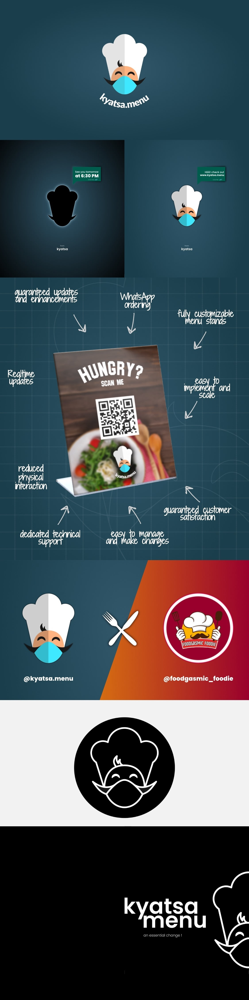

Ideated in 2021, Kyatsa Menu was created to help restaurants an cafes to take their menus digital. In the light of the COVID pandemic this was an essential step that these businesses took. Enforcing social distancing and no contact menus quickly faded and better solutions came to the market. All said it was a great learning experience.

## Branding, Logo Design, Marketing

